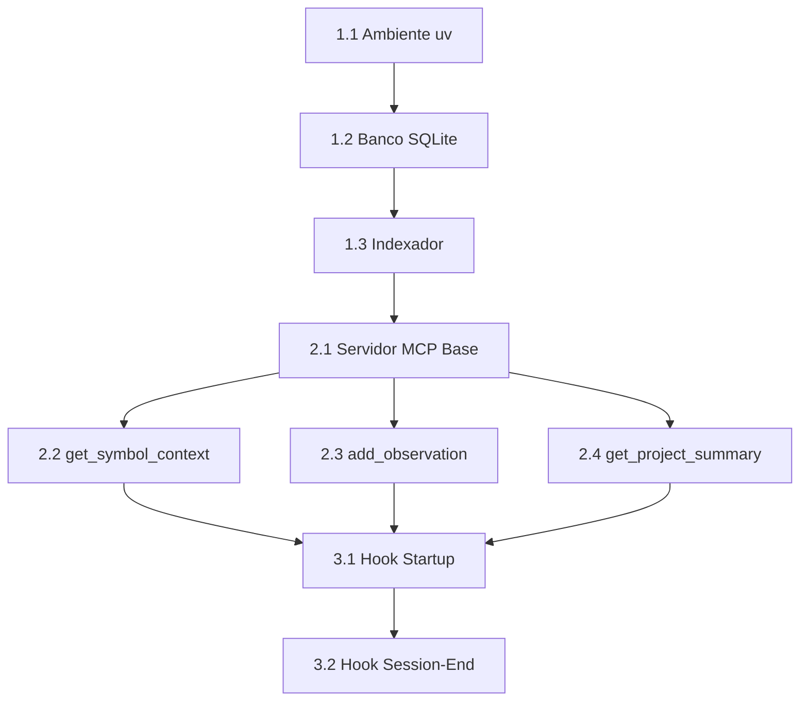

# Backlog do Projeto - MCP Context Server

**Última Atualização:** 2026-04-02
**Versão do PRD:** 4.1
**Responsável:** Engenheiro de IA

---

## 📋 Requisitos Técnicos Extraídos do PRD

### Stack Mandatória
- **Linguagem:** Python 3.10+ (Type Hinting + Asyncio)
- **SDK MCP:** Biblioteca oficial `mcp` para JSON-RPC sobre STDIO
- **Banco de Dados:** SQLite 3 (arquivo `.claude/context.db`)
- **Gerenciador:** `uv` (MANDATÓRIO - 100x mais rápido que pip)
- **Parser:** tree-sitter para AST (não Regex simples)

### KPIs de Sucesso
| Métrica | Meta | Como Medir |
|---------|------|------------|
| Tokens por mensagem | < 3.000 | Contagem de tokens na resposta |
| Erros de assinatura | -80% | Logs de erro do servidor |
| Tempo de indexação | < 100ms | Benchmark incremental |
| Cobertura de símbolos | 100% | Contagem de símbolos indexados |

### Heurísticas de Relevância (4 Regras de Ouro)
1. **1-Level Reach:** Não expandir recursivamente
2. **Payload Assimétrico:** Body para alvo, signature para vizinhos
3. **Top 5 Insights:** Filtrar observações por relevância
4. **Curiosidade Direcionada:** Metadados sugerem próximas consultas

---

## 🔴 P0 - Crítico (Sprint 1-2)

### FASE 1: Infraestrutura Base (3-5 dias)

#### 1.1 Configuração do Ambiente
- [ ] **Inicializar projeto com uv**
  - [ ] `uv init context-server` (se necessário)
  - [ ] Verificar Python 3.10+ instalado
  - [ ] Criar estrutura de diretórios:
    ```
    src/
    ├── database/
    │   ├── __init__.py
    │   ├── schema.py
    │   └── connection.py
    ├── indexer/
    │   ├── __init__.py
    │   ├── parser.py
    │   └── incremental.py
    ├── mcp_server/
    │   ├── __init__.py
    │   ├── server.py
    │   └── tools/
    │       ├── get_symbol_context.py
    │       ├── add_observation.py
    │       └── get_project_summary.py
    └── main.py
    ```
  - [ ] Validar com `uv sync`

- [ ] **Instalar dependências via uv**
  - [ ] `uv add mcp` (SDK oficial)
  - [ ] `uv add tree-sitter`
  - [ ] `uv add tree-sitter-languages`
  - [ ] Nota: sqlite3 vem com Python padrão
  - [ ] Validar importações

#### 1.2 Banco de Dados SQLite
- [ ] **Implementar esquema relacional**
  - [ ] Criar `src/database/schema.py`
  - [ ] Tabela `symbols`:
    ```sql
    CREATE TABLE symbols (
      id TEXT PRIMARY KEY,  -- UUID
      name TEXT NOT NULL,
      file TEXT NOT NULL,
      body TEXT,
      signature TEXT,
      type TEXT CHECK(type IN ('class', 'function', 'method')),
      start_line INTEGER,
      end_line INTEGER,
      last_updated TIMESTAMP DEFAULT CURRENT_TIMESTAMP,
      file_hash TEXT
    );
    CREATE INDEX idx_symbols_name ON symbols(name);
    CREATE INDEX idx_symbols_file ON symbols(file);
    ```
  - [ ] Tabela `dependencies`:
    ```sql
    CREATE TABLE dependencies (
      id TEXT PRIMARY KEY,
      caller_id TEXT NOT NULL,
      callee_id TEXT NOT NULL,
      call_site_line INTEGER,
      FOREIGN KEY (caller_id) REFERENCES symbols(id),
      FOREIGN KEY (callee_id) REFERENCES symbols(id)
    );
    CREATE INDEX idx_deps_caller ON dependencies(caller_id);
    CREATE INDEX idx_deps_callee ON dependencies(callee_id);
    ```
  - [ ] Tabela `observations`:
    ```sql
    CREATE TABLE observations (
      id TEXT PRIMARY KEY,
      symbol_id TEXT NOT NULL,
      note TEXT NOT NULL,
      category TEXT CHECK(category IN ('bug', 'refactor', 'logic', 'architecture')),
      priority INTEGER DEFAULT 3 CHECK(priority BETWEEN 1 AND 5),
      is_stale BOOLEAN DEFAULT FALSE,
      session_id TEXT,
      created_at TIMESTAMP DEFAULT CURRENT_TIMESTAMP,
      FOREIGN KEY (symbol_id) REFERENCES symbols(id)
    );
    CREATE INDEX idx_obs_symbol ON observations(symbol_id);
    CREATE INDEX idx_obs_stale ON observations(is_stale);
    ```
  - [ ] Tabela `project_metadata`:
    ```sql
    CREATE TABLE project_metadata (
      key TEXT PRIMARY KEY,
      value TEXT,
      last_modified TIMESTAMP DEFAULT CURRENT_TIMESTAMP
    );
    ```
  - [ ] Tabela `file_hashes` (para incremental):
    ```sql
    CREATE TABLE file_hashes (
      file_path TEXT PRIMARY KEY,
      hash TEXT NOT NULL,
      last_indexed TIMESTAMP DEFAULT CURRENT_TIMESTAMP
    );
    ```

- [ ] **Implementar lógica de staleness**
  - [ ] Trigger automático quando `body` muda:
    ```sql
    CREATE TRIGGER mark_stale
    AFTER UPDATE OF body ON symbols
    BEGIN
      UPDATE observations
      SET is_stale = TRUE
      WHERE symbol_id = NEW.id;
    END;
    ```
  - [ ] Função Python para verificar staleness

- [ ] **Criar connection manager**
  - [ ] `src/database/connection.py`
  - [ ] Singleton para conexão com `.claude/context.db`
  - [ ] Métodos CRUD genéricos
  - [ ] Validação de Path Traversal

#### 1.3 Indexador tree-sitter
- [ ] **Implementar parser Python**
  - [ ] Criar `src/indexer/parser.py`
  - [ ] Carregar linguagem: `tree_sitter_languages.get_language('python')`
  - [ ] Queries para extrair:
    - Classes: `(class_definition name: (identifier) @class_name)`
    - Funções: `(function_definition name: (identifier) @func_name)`
    - Métodos: `(function_definition (block (expression_statement (call))) @method)`
    - Imports: `(import_statement) @import`
    - Calls: `(call function: (identifier) @call_name)`

- [ ] **Mapear dependências**
  - [ ] Identificar chamadas dentro de cada símbolo
  - [ ] Criar relação caller → callee
  - [ ] Armazenar linha da chamada

- [ ] **Implementar modo incremental**
  - [ ] Calcular hash SHA256 de arquivos
  - [ ] Comparar com `file_hashes`
  - [ ] Re-indexar apenas mudanças
  - [ ] Atualizar tabela de hashes

- [ ] **Criar ponto de entrada**
  - [ ] `src/indexer/__main__.py`
  - [ ] Flags: `--incremental`, `--full`, `--verbose`
  - [ ] Exemplo: `uv run -m indexer --incremental`

### FASE 2: Servidor MCP (5-7 dias)

#### 2.1 Estrutura Base do Servidor
- [ ] **Configurar servidor MCP**
  - [ ] Criar `src/mcp_server/server.py`
  - [ ] Importar SDK: `from mcp.server import Server`
  - [ ] Configurar comunicação STDIO:
    ```python
    from mcp.server.stdio import stdio_server
    app = Server("context-server")
    ```
  - [ ] Registrar ferramentas com `@app.list_tools()`
  - [ ] Handler de execução com `@app.call_tool()`

- [ ] **Implementar logging estruturado**
  - [ ] Logs em `.claude/context.log`
  - [ ] Níveis: DEBUG, INFO, ERROR
  - [ ] Rotação de logs

#### 2.2 Ferramenta: get_symbol_context
- [ ] **Implementar handler**
  - [ ] Criar `src/mcp_server/tools/get_symbol_context.py`
  - [ ] Schema de input:
    ```json
    {
      "name": "get_symbol_context",
      "description": "Obtém contexto completo de um símbolo",
      "inputSchema": {
        "type": "object",
        "properties": {
          "symbol_name": {"type": "string"},
          "include_docstring": {"type": "boolean", "default": true}
        },
        "required": ["symbol_name"]
      }
    }
    ```
  - [ ] Query SQL:
    ```sql
    -- Símbolo alvo
    SELECT * FROM symbols WHERE name = ?;

    -- Dependências (1-Level Reach)
    SELECT s.name, s.signature, s.type, d.call_site_line
    FROM symbols s
    JOIN dependencies d ON s.id = d.callee_id
    WHERE d.caller_id = ?;

    -- Chamadores
    SELECT s.name, s.signature, s.type
    FROM symbols s
    JOIN dependencies d ON s.id = d.caller_id
    WHERE d.callee_id = ?;

    -- Observações ativas
    SELECT * FROM observations
    WHERE symbol_id = ? AND is_stale = FALSE
    ORDER BY priority DESC, created_at DESC
    LIMIT 5;
    ```

- [ ] **Aplicar heurísticas**
  - [ ] Body completo para símbolo alvo
  - [ ] Apenas signature para vizinhos
  - [ ] Limitar a 5 observações
  - [ ] Metadados de sugestão:
    ```json
    {
      "suggested_queries": [
        "get_symbol_context('DatabaseConnector')",
        "get_symbol_context('UserRepository')"
      ]
    }
    ```

- [ ] **Validação de segurança**
  - [ ] Sanitizar `symbol_name` (SQL injection)
  - [ ] Validar caminhos de arquivo

#### 2.3 Ferramenta: add_observation
- [ ] **Implementar handler**
  - [ ] Criar `src/mcp_server/tools/add_observation.py`
  - [ ] Schema de input:
    ```json
    {
      "name": "add_observation",
      "description": "Registra observação sobre um símbolo",
      "inputSchema": {
        "type": "object",
        "properties": {
          "symbol_name": {"type": "string"},
          "content": {"type": "string"},
          "category": {
            "type": "string",
            "enum": ["bug", "refactor", "logic", "architecture"]
          },
          "priority": {"type": "integer", "minimum": 1, "maximum": 5}
        },
        "required": ["symbol_name", "content"]
      }
    }
    ```
  - [ ] Validar existência do símbolo
  - [ ] Gerar UUID para observação
  - [ ] Inserir no banco:
    ```sql
    INSERT INTO observations (id, symbol_id, note, category, priority, session_id)
    VALUES (?, (SELECT id FROM symbols WHERE name = ?), ?, ?, ?, ?);
    ```

- [ ] **Retornar confirmação**
  ```json
  {
    "observation_id": "uuid-here",
    "symbol_name": "UserAuth",
    "status": "recorded",
    "stale_warning": false
  }
  ```

#### 2.4 Ferramenta: get_project_summary
- [ ] **Implementar handler**
  - [ ] Criar `src/mcp_server/tools/get_project_summary.py`
  - [ ] Schema: input vazio
  - [ ] Agregar dados:
    ```sql
    -- Estatísticas
    SELECT COUNT(*) as total_symbols FROM symbols;
    SELECT COUNT(*) as total_observations FROM observations WHERE is_stale = FALSE;
    SELECT type, COUNT(*) FROM symbols GROUP BY type;

    -- Arquivos modificados (últimas 24h)
    SELECT file, last_updated
    FROM symbols
    WHERE last_updated > datetime('now', '-1 day')
    ORDER BY last_updated DESC;
    ```

- [ ] **Ler state.md**
  - [ ] Parsear `docs/context/state.md`
  - [ ] Extrair status atual
  - [ ] Incluir no resumo

- [ ] **Formatar resposta**
  ```json
  {
    "project_status": "...",
    "statistics": {
      "symbols": 500,
      "observations": 23,
      "files_indexed": 42
    },
    "recent_changes": [...],
    "stale_observations": 3
  }
  ```

---

## 🟡 P1 - Importante (Sprint 3)

### FASE 3: Hooks e Integração (3-4 dias)

#### 3.1 Hook de Startup
- [ ] **Criar script de inicialização**
  - [ ] `.claude/hooks/startup.sh`
  - [ ] Conteúdo:
    ```bash
    #!/bin/bash
    echo "🔄 Sincronizando contexto..."
    uv run -m indexer --incremental
    echo "📊 Resumo do projeto:"
    uv run -c "from src.mcp_server.tools.get_project_summary import get_summary; print(get_summary())"
    echo "✅ Pronto!"
    ```
  - [ ] Permissões: `chmod +x .claude/hooks/startup.sh`

- [ ] **Configurar no settings.json**
  - [ ] Adicionar ao `.claude/settings.json`:
    ```json
    {
      "hooks": {
        "session-start": ".claude/hooks/startup.sh"
      }
    }
    ```

#### 3.2 Hook de Session-End
- [ ] **Criar script de finalização**
  - [ ] `.claude/hooks/session-end.sh`
  - [ ] Verificar se `state.md` foi atualizado
  - [ ] Aviso se não atualizado

#### 3.3 Validações de Segurança
- [ ] **Proteção Path Traversal**
  - [ ] Validar caminhos absolutos
  - [ ] Rejeitar `../` em caminhos
  - [ ] Limitar ao root do projeto

- [ ] **Sanitização de Inputs**
  - [ ] Escapar caracteres especiais
  - [ ] Validar tipos de dados
  - [ ] Limitar tamanho de inputs

---

## 🟢 P2 - Nice to Have (Backlog Futuro)

### Expansão de Linguagens
- [ ] **JavaScript/TypeScript**
  - [ ] Parser tree-sitter para JS/TS
  - [ ] Suporte a imports ES6
  - [ ] Detectar exports

- [ ] **Go**
  - [ ] Parser tree-sitter para Go
  - [ ] Detectar goroutines e channels

- [ ] **Rust**
  - [ ] Parser tree-sitter para Rust
  - [ ] Detectar traits e impls

### Métricas Avançadas
- [ ] **Dashboard de tokens**
  - [ ] Contador de tokens economizados
  - [ ] Gráfico de uso por sessão
  - [ ] ROI do sistema

- [ ] **Observabilidade**
  - [ ] Logs estruturados em JSON
  - [ ] Métricas de performance
  - [ ] Alertas de anomalias

### Ferramentas Adicionais
- [ ] **search_symbols**
  - [ ] Busca fuzzy por nome
  - [ ] Filtros por tipo e arquivo

- [ ] **invalidate_cache**
  - [ ] Forçar re-indexação completa
  - [ ] Limpar observações obsoletas

---

## 📊 Dependências Entre Tarefas



---

## 🎯 Critérios de Aceitação (Definition of Done)

### Para cada tarefa P0:
- [ ] Código implementado segue padrões do CLAUDE.md
- [ ] Testado manualmente com `uv run`
- [ ] Documentado em `docs/context/decisions.md` se arquitetural
- [ ] Atualizado `state.md` com progresso
- [ ] Commit realizado

### Para o MVP (fase P0 completa):
- [ ] Servidor MCP funcional via STDIO
- [ ] 3 ferramentas operacionais
- [ ] Indexador incremental < 100ms
- [ ] Tokens por resposta < 3.000
- [ ] Hooks de startup/session-end funcionando

---

## 📅 Estimativa de Timeline

| Fase | Duração | Entregável |
|------|---------|------------|
| FASE 1 | 3-5 dias | Banco + Indexador |
| FASE 2 | 5-7 dias | Servidor MCP + 3 Tools |
| FASE 3 | 3-4 dias | Hooks + Segurança |
| **Total MVP** | **11-16 dias** | Sistema funcional |

---

## 🔗 Arquivos Relacionados
- **PRD:** `docs/PRD_Context_Server.md`
- **Estado Atual:** `docs/context/state.md`
- **Decisões:** `docs/context/decisions.md`
- **Journal:** `docs/context/journal.md`
- **Validação:** `docs/context/VALIDATION_CHECKLIST.md`

---

## 📝 Notas Importantes
- **MANDATÓRIO:** Usar `uv` para todos comandos Python
- **PROIBIDO:** pip install, Vector DBs, embeddings
- **SEMPRE:** Consultar contexto antes de editar código
- **KPI:** < 3.000 tokens por mensagem

---

**Próxima Ação:** Iniciar FASE 1.1 - Configurar ambiente uv
